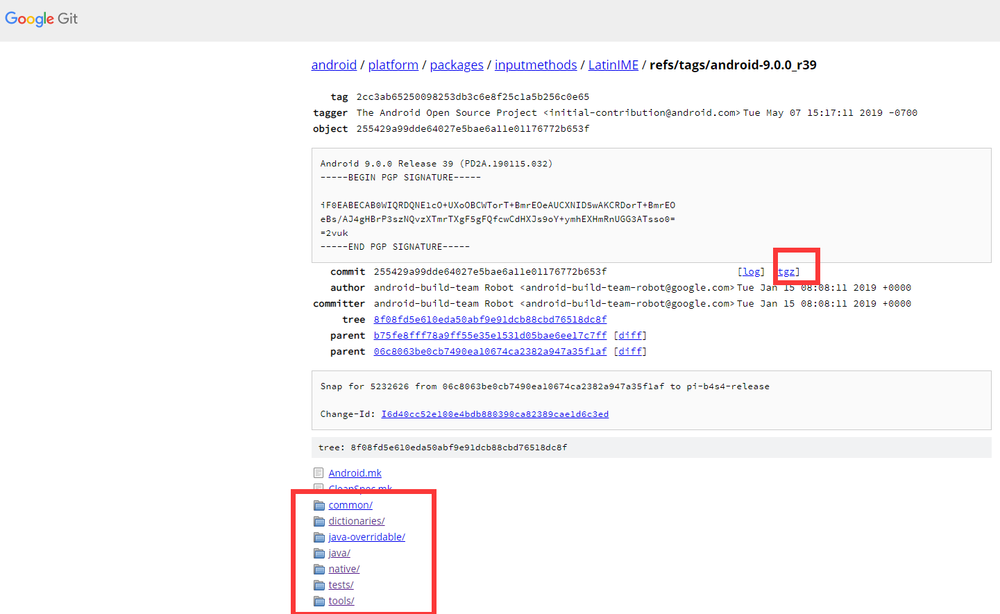
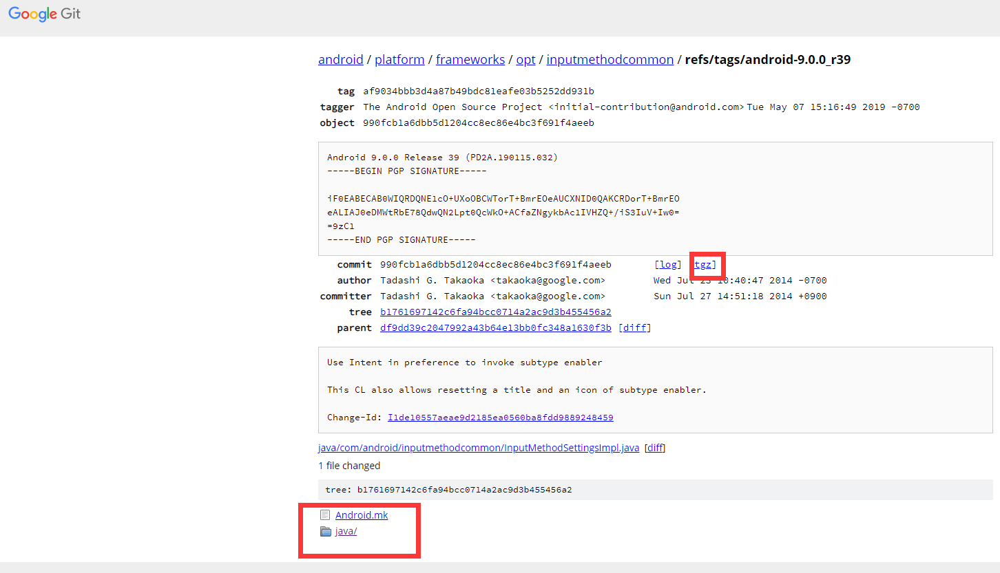
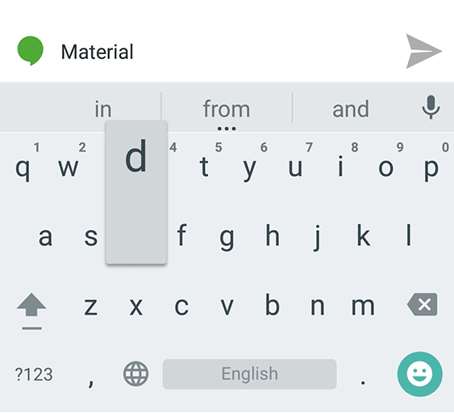

# Google 输入法源码

基于Android 源码 **android-9.0.0_r39** tag节点，下载相关tgz压缩包，将源码移植到 AS 工程里面。已编译运行成功！

# 源码地址
platform/packages/inputmethods/LatinIME

[https://android.googlesource.com/platform/packages/inputmethods/LatinIME/+/refs/tags/android-9.0.0_r39](https://android.googlesource.com/platform/packages/inputmethods/LatinIME/+/refs/tags/android-9.0.0_r39)



其中 com.android.inputmethod.latin.settings.SettingsFragment 需要导入

```aidl
import com.android.inputmethodcommon.InputMethodSettingsFragment;
```
platform/frameworks/opt/inputmethodcommon

具体地址： [https://android.googlesource.com/platform/frameworks/opt/inputmethodcommon/+/refs/tags/android-9.0.0_r39](https://android.googlesource.com/platform/frameworks/opt/inputmethodcommon/+/refs/tags/android-9.0.0_r39)

](https://android.googlesource.com/platform/packages/inputmethods/LatinIME/+/refs/tags/android-9.0.0_r39)




运行效果预览




注：在Android Studio编辑器中，因为编辑器问题，资源文件声明没有识别，所有以下文件提示找不到，但实际上能够还是能直接**编译生成apk文件**

EmojiCategory

```
    private static final int[] sCategoryTabIconAttr = {
            R.styleable.EmojiPalettesView_iconEmojiRecentsTab,
            R.styleable.EmojiPalettesView_iconEmojiCategory1Tab,
            R.styleable.EmojiPalettesView_iconEmojiCategory2Tab,
            R.styleable.EmojiPalettesView_iconEmojiCategory3Tab,
            R.styleable.EmojiPalettesView_iconEmojiCategory4Tab,
            R.styleable.EmojiPalettesView_iconEmojiCategory5Tab,
            R.styleable.EmojiPalettesView_iconEmojiCategory6Tab,
            R.styleable.EmojiPalettesView_iconEmojiCategory7Tab,
            R.styleable.EmojiPalettesView_iconEmojiCategory8Tab,
            R.styleable.EmojiPalettesView_iconEmojiCategory9Tab,
            R.styleable.EmojiPalettesView_iconEmojiCategory10Tab,
            R.styleable.EmojiPalettesView_iconEmojiCategory11Tab,
            R.styleable.EmojiPalettesView_iconEmojiCategory12Tab,
            R.styleable.EmojiPalettesView_iconEmojiCategory13Tab,
            R.styleable.EmojiPalettesView_iconEmojiCategory14Tab,
            R.styleable.EmojiPalettesView_iconEmojiCategory15Tab,
            R.styleable.EmojiPalettesView_iconEmojiCategory16Tab };
```
GestureStrokeRecognitionParams

```
    public GestureStrokeRecognitionParams(final TypedArray mainKeyboardViewAttr) {
        mStaticTimeThresholdAfterFastTyping = mainKeyboardViewAttr.getInt(
                R.styleable.MainKeyboardView_gestureStaticTimeThresholdAfterFastTyping,
                DEFAULT.mStaticTimeThresholdAfterFastTyping);
        mDetectFastMoveSpeedThreshold = ResourceUtils.getFraction(mainKeyboardViewAttr,
                R.styleable.MainKeyboardView_gestureDetectFastMoveSpeedThreshold,
                DEFAULT.mDetectFastMoveSpeedThreshold);
        mDynamicThresholdDecayDuration = mainKeyboardViewAttr.getInt(
                R.styleable.MainKeyboardView_gestureDynamicThresholdDecayDuration,
                DEFAULT.mDynamicThresholdDecayDuration);
        mDynamicTimeThresholdFrom = mainKeyboardViewAttr.getInt(
                R.styleable.MainKeyboardView_gestureDynamicTimeThresholdFrom,
                DEFAULT.mDynamicTimeThresholdFrom);
        mDynamicTimeThresholdTo = mainKeyboardViewAttr.getInt(
                R.styleable.MainKeyboardView_gestureDynamicTimeThresholdTo,
                DEFAULT.mDynamicTimeThresholdTo);
        mDynamicDistanceThresholdFrom = ResourceUtils.getFraction(mainKeyboardViewAttr,
                R.styleable.MainKeyboardView_gestureDynamicDistanceThresholdFrom,
                DEFAULT.mDynamicDistanceThresholdFrom);
        mDynamicDistanceThresholdTo = ResourceUtils.getFraction(mainKeyboardViewAttr,
                R.styleable.MainKeyboardView_gestureDynamicDistanceThresholdTo,
                DEFAULT.mDynamicDistanceThresholdTo);
        mSamplingMinimumDistance = ResourceUtils.getFraction(mainKeyboardViewAttr,
                R.styleable.MainKeyboardView_gestureSamplingMinimumDistance,
                DEFAULT.mSamplingMinimumDistance);
        mRecognitionMinimumTime = mainKeyboardViewAttr.getInt(
                R.styleable.MainKeyboardView_gestureRecognitionMinimumTime,
                DEFAULT.mRecognitionMinimumTime);
        mRecognitionSpeedThreshold = ResourceUtils.getFraction(mainKeyboardViewAttr,
                R.styleable.MainKeyboardView_gestureRecognitionSpeedThreshold,
                DEFAULT.mRecognitionSpeedThreshold);
    }
    
```
